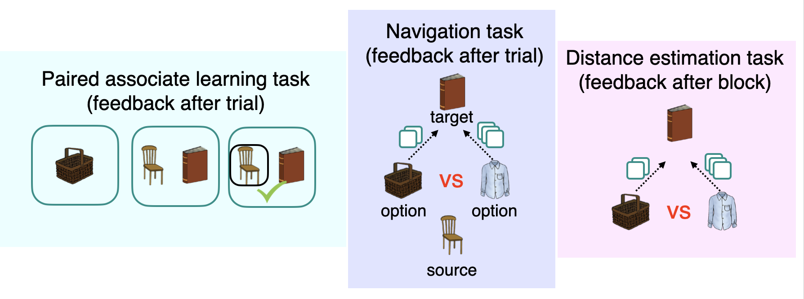

> **Big Thanks** to my collaborators at the Department of Psychology @MPI-CBS. This was a long shot... Perhaps in a different circumstance this could have worked? We should perhaps revisit it at some point again? The idea was cool!

---

---

#### Idea

*Imagine a child going to a dentist. Typically, the visit follows a predictable sequence of events: checking in at reception, waiting to be called, reporting any discomfort to the specialist, and undergoing a medical procedure, such as a tooth filling, which is sometimes associated with pain. A similar sequence of events occurs when visiting an otolaryngologist (ENT), for example, for ear cleaning. Would the child start to worry while sitting in the waiting room of the ENT? Would they feel nervous when seeing the ENT doctor just minutes before the procedure?*

---

#### Description

Predicting danger is crucial for survival. Pavlovian threat conditioning elegantly describes how we learn to recognize threats through associative learning so that upon their detection we mobilise our defensive system to cope with anticipated harm.
However, it remains unclear how individuals gauge danger in novel situations, elements of which have never been experienced in an aversive context. Here, we examined whether individuals transfer Pavlovian threat memory across contexts based on their common underlying relational structure. We hypothesised that conditioned threat responses would generalise to novel stimuli according to a latent relational structure that is inferred to be common across two contexts (envoronments).

It has recently been proposed that grid cells, known to be located in brain regions such as the entorhinal cortex and the medial prefrontal cortex do not store relations among specific sensory stimuli, but they may instead reflect abstract relations that are common in a variety of situations. This can be achieved by extracting generic and stable patterns of contingencies across environments with different sensory features. For example, in a remapping experiment where animals are moved between boxes that differ in sensory features, entorhinal representations embed the general relationships between locations regardless of the sensory differences between boxes while hippocampal place cells remap. In a similar vein, our group recently observed in human participants using functional magnetic resonance imaging (fMRI) that a map-like organization of relations between discrete objects can be abstracted away from its sensory input, and form an abstract relational structure in the medial prefrontal cortex. Such an abstract representation of structured knowledge is very useful, because it can be applied to new environments with a shared relational structure and thus help predict reinforcement in new situations. 

In this project, we aimed to explore:
+ What are the neural mechanisms underlying the generalization of threat responses to stimuli that were never part of conditioning?
+ What are the neural mechanisms underlying across-structure genralisation? 
+ Does the across-structure generalisation emrge only after delay (i.e., consolidation)?

To this end, we use behavioural tasks whereby participants acquire knowledge of relations among multiple neutral stimuli (i.e., images). The relations between these stimuli follow an abstract structure characterized by a graph consisting of several nodes and vertices, such that each node reflects a stimulus and a vertex reflects an association between two stimuli. Having acquired such a relational knowledge, one of the stimuli, through Pavlovian threat conditioning, acquires an association with an aversive outcome (a mild brief electric shock). 

Since participants have previously learned the embedding of this stimulus in an overarching relational structure, we hypothesise that the resulting threat memory generalizes to associated stimuli, leading to Pavlovian threat responses that scales with its distances to the stimulus predictive of the aversive outcome. We test this in a subsequent generalisation test, involving stimuli that were never part of conditioning. 

Further, to test whether the structure knowledge can be transferred to novel situations characterized by the same underlying relational structure, participants are additionally exposed to stimuli that constitute a separate instance of the same relational graph, i.e., a separate graph that contains stimuli none of which was ever predictive of the aversive outcome but follow the same relational structure. 

We hypothesise that the generalized expression of Pavlovian threat responses to novel situations is possible due to the underlying representation of the relational knowledge in the hippocampal-entorhinal area or the medial prefrontal cortex. To test this hypothesis, we use fMRI data to perform representational similarity analysis and fMRI adaptation analysis that allows to assess how similar the neuronal representations of the objects forming the graphs are. We predict that the more the representations of corresponding objects are alike, the more chance for the threat generalization. We will test this assumption across participants by trying to predict threat generalization from individual differences in representational similarity.

This way, individuals may protect from danger in a variety of situations despite their very limited initial aversive experience (see [Baczkowski et al.](https://doi.org/10.1016/j.tics.2023.02.005)).

## Acknowledgment

Pilot experiments were collected at the [Department of Psychology](https://www.cbs.mpg.de/departments/psychology), Max Planck Institute for Human Cognitive and Brain Sciences in Leipzig, Germany. 
The study was approved by the local ethical review board (University of Leipzig, Germany) registered under 108/20-ek.
This work was supported by the Max Planck Society. 
We thank Kerstin Träger for help with data collection. 

## License 

This work is licensed under [CC BY 4.0](https://creativecommons.org/licenses/by/4.0/?ref=chooser-v1).

---

##### Download

+ [Presentation slides on pilot experiments [PDF 4.1 MB]](presentation.pdf)

