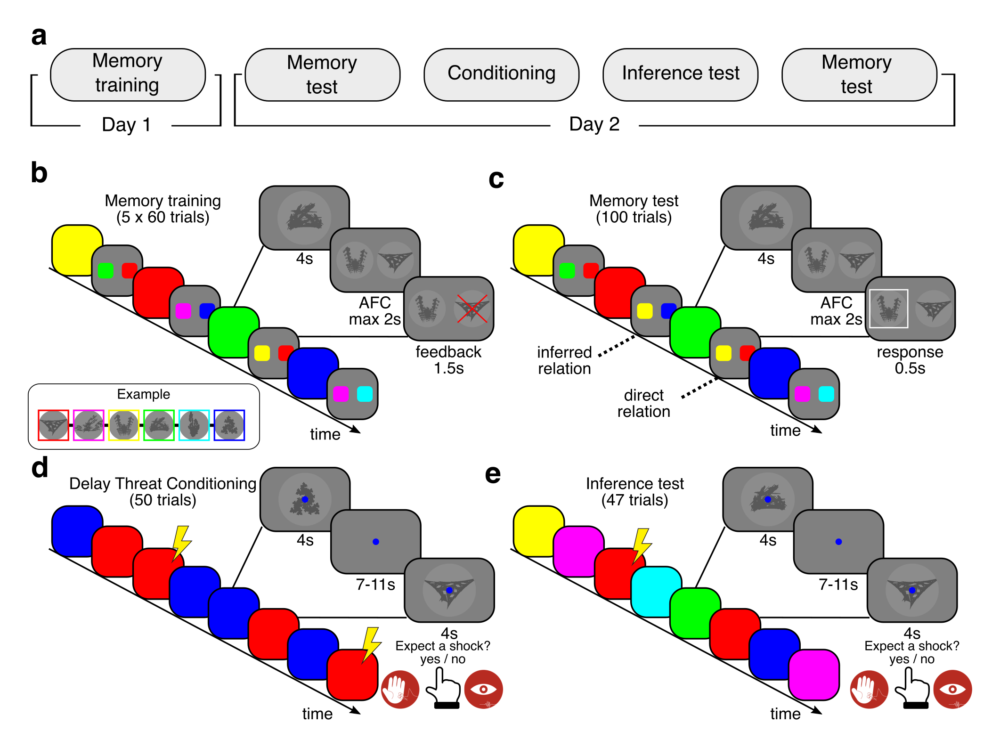

> **Huge thanks** to my collaborators at the Department of Neurology [@MPI-CBS](https://www.cbs.mpg.de/en), and to everyone at [Donders Institute](https://www.ru.nl/en/donders-institute) for their support with study design and data collection. 

---

---

 
#### Abstract

Learning about danger through exposure to harmful events relies on Pavlovian conditioning, which enables individuals to prepare for potential threats when encountering the same or similar warning signals in the future. Yet Pavlovian threat memories alone cannot explain defensive behavior in situations where such cues are absent. Here, we tested whether Pavlovian learning interacts with prior neutral memories acquired across multiple episodes, such that the relational structure among these memories guides defensive responses to cues never experienced in an aversive context. Participants first learned overlapping pairs of neutral images that together formed an abstract linear graph. The following day, the two images located at opposite ends of the graph were differentially paired with mild electric shocks through conditioning, thereby establishing them as threat and safety signals. When later exposed to the remaining images under risk of shock, participants exhibited graded defensive responses across self-report and physiological measures that scaled with the mnemonic proximity of each image to the shock-predictive image. These findings suggest that adaptive defense can arise from the interaction of Pavlovian associations with a pre-existing relational memory structure formed across neutral episodes, allowing individuals to prepare for danger even in situations beyond directly learned threats.

---

### Acknowledgment

BMB was supported by the Max Planck Society, the International Max Planck Research School “NeuroCom”, University of Leipzig, and Leibniz Program of the Research Academy Leipzig.

## License 

This work is licensed under [CC BY 4.0](https://creativecommons.org/licenses/by/4.0/?ref=chooser-v1).

---