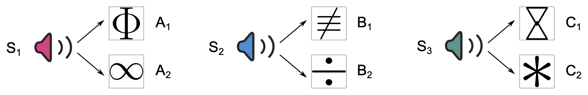

#### Idea

*Imagine you frequently walk past a particular house with a fenced yard and a barking dog inside. You hardly pay attention to the house or the fence -- they’re just part of your daily routine. One day, however, you surprisingly encounter the aggressive dog on a street nearby, and barking furiously it attacks you. Next time, would you walk past your standard route by the fence again? If not, at what point would you decide to change your route?*

---

#### Background

Individuals are equipped with defensive behaviours tailored to the imminence of danger, such as freezing to proximal and perceptible threats as well as avoiding more distal and foreseeable ones. Critically, while learning about threats and defensive behaviour is generally adaptive, excessive threat-related responses can become maladaptive and a burden in people’s daily life, as it is in the case of individuals diagnosed with fear-related disorders. Therefore, the question of how individuals recognize dangerous situations and respond to them is fundamental for understanding the adaptive nature of human learning, memory, and emotions which in the long run may help us to develop better diagnostic criteria and more effective interventions for psychiatric disorders.

Current models of fear-related psychopathology rest upon Pavlovian threat conditioning -- a fundamental associative learning mechanism of how individuals acquired threat memories. However, the acquired Pavlovian threat memory on its own is insufficient to forecast potential danger when a detectable threat is absent. One way to approach such a challenge is to use Pavlovian threat memory together with a pre-existing knowledge of predictive relations in the environment. For example, in an iconic sensory pre-conditioning paradigm (Brogden, 1939), individuals first learn a predictive relation between two neutral cues such that A leads to B. Next, B is separately associated with an aversive outcome (US) during conditioning. Afterwards, when individuals are confronted with the pre-conditioned cue A and the risk of the US is present, they exhibit defensive responses as if they started preparing for the anticipated harm ahead of time. The sensory pre-conditioning paradigm illustrates that individuals can infer risk of potential harm from cues that were never experienced in an aversive context.

This inference requires to combine, through a common element, a separately acquired Pavlovian threat memory with the pre-existing knowledge of environmental relations. Since these memories are formed in two distinct episodes (and likely in two different contexts), the relevance of the pre-conditioned cues for predicting potential harm is not immediately obvious since at the time of encoding they do not predict anything of behavioural relevance – memory reactivation of the veridical pre-conditioned relations alone leads to the prediction of just another neutral cue. Yet, if the two memories are integrated, the pre- conditioned cues may predict the cue that (through conditioning) has changed its meaning into a threatening one. Therefore, after such memory integration, individuals may use pre-conditioned cues to minimize the risk of a threat encounter (the CS leading to the US), and ultimately avoid harm.

Here, we aim to test whether pre-existing relational and threat memories can be integrated without an explicit need (i.e., when the risk of US is not explicitly present) such that the pre-conditioning cues have automatic access to the reinforcing properties of the CS, which can then motivate individuals for avoidance decisions aimed at minimizing potential harm ahead of time.

This way, individuals may protect from danger in a variety of situations despite their very limited initial aversive experience (see [Baczkowski et al.](https://doi.org/10.1016/j.tics.2023.02.005)).

## Acknowledgment

This was work supported by the [Department of Cognitive Psychology](), Universitaet Hamburg, Germany. 
The study was approved by the local ethical review board.

## License 

This work is licensed under [CC BY 4.0](https://creativecommons.org/licenses/by/4.0/?ref=chooser-v1).

---

##### Download

+ [Presentation slides [PDF 7.8 MB]](presentation.pdf)

