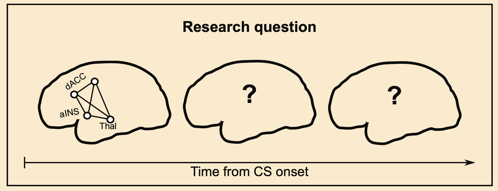

---

> A side project to follow up on my previous NeuroImage paper on dynamic functional connectivity [Baczkowski et al.](http://dx.doi.org/10.1016/j.neuroimage.2017.03.022).  **Big thanks** to my colleagues from the former *Neuroanatomy & Connectivity* group @MPI-CBS. Did we drink all the *Club Mate*? And remember -- always tick that box to apply for the merit award so that you get the funding when they invite you for a talk! I didn't...

##### Abstract

Fear conditioning is a type of learning that involves pairing an aversive stimulus (the unconditioned stimulus, UCS) with a neutral stimulus (the conditioned stimulus, CS). fMRI research has shown that CS co-activates subcortical and cortical regions of the salience network. Here, we explored whether CS lead to subsequent activity beyond the salience network, potentially indicating multiple levels of CS representation expressed in a sequence of spatially distinct co-activation patterns. To induce learning associations between a visual cue and electric shock, we used an instructed delay conditioning task with partial reinforcement in 29 healthy individuals (14 female, median age 24 y/o). To investigate spatio-temporal evolution of brain activity, we estimated second-by-second whole-brain BOLD activation over 15 seconds after the onset of a visual cue indicating either safety or threat. While safety cues induced an early activation restricted primarily to visual areas of the occipital lobe, threat-related cues induced complex whole-brain spatio-temporal patterns. These patterns comprised an early activation in cingulo-opercular regions of the salience network and late activation in lateral regions of the default mode network in the prefrontal, temporal, and parietal cortex. The transient shift between the two networks was accompanied by the intermediate activation of the right dorso-lateral prefrontal cortex, which belongs to the cognitive control network. We conclude that threat-related cues triggered coordinated brain activity that unfolded over a 15-second period from salience to default mode regions. The observed sequence of co-activation patterns may reflect continual elaboration of threat-related information beyond low-level automatic associations.

## License 

This work is licensed under [CC BY 4.0](https://creativecommons.org/licenses/by/4.0/?ref=chooser-v1).

---

##### Related material [CC-BY 4.0]

+ [OHBM Presentation [25 MB]](baczkowski_ohbm_2017_talk.pdf)
+ [OHBM Poster [35 MB]](document_cmyk.png)