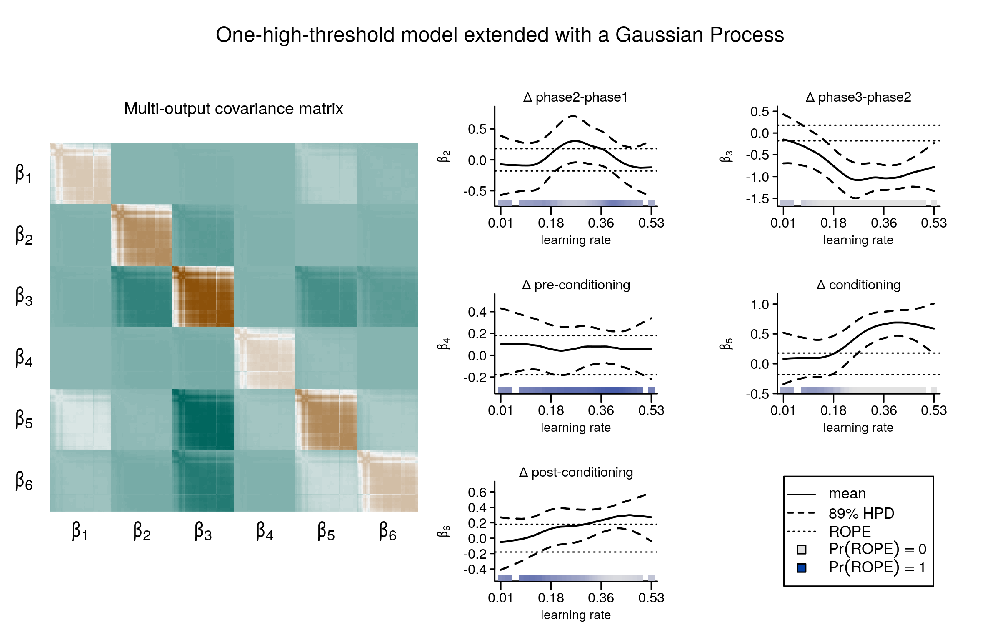

> **Big Thanks** to my collaborators at the Department of Cognitive Psychology @UHH and @HiB in Tuebingen.

---

---

#### Abstract

Aversive experiences are prioritized in long-term episodic memory. However, it remains unclear whether emotional learning strengthens episodic memory for relevant but initially ambiguous experiences. We examined individual differences in retro- and proactive memory prioritization of semantically related information by Pavlovian threat conditioning, applying a Bayesian high-threshold recognition model. Young healthy adults (N=285) encoded neutral images from two semantic categories across three phases: pre-conditioning, conditioning, and post-conditioning. Results showed no enhanced memory for images from the shock-predictive category encoded before or after conditioning. Recognition performance, however, was strongly correlated across phases within individuals. Two latent profiles of memory organization emerged, independent of physiological arousal or associative learning rate: one structured by phase, the other by conditioning, with category-selective memory prioritization carrying over into the post-conditioning phase. These findings shift the question from *if* to *when* emotional learning shapes memory for neutral information encoded close in time.

**TO BE RELEASED SOON -- STAY TUNED**

## License 

This work is licensed under [CC BY 4.0](https://creativecommons.org/licenses/by/4.0/?ref=chooser-v1).

---