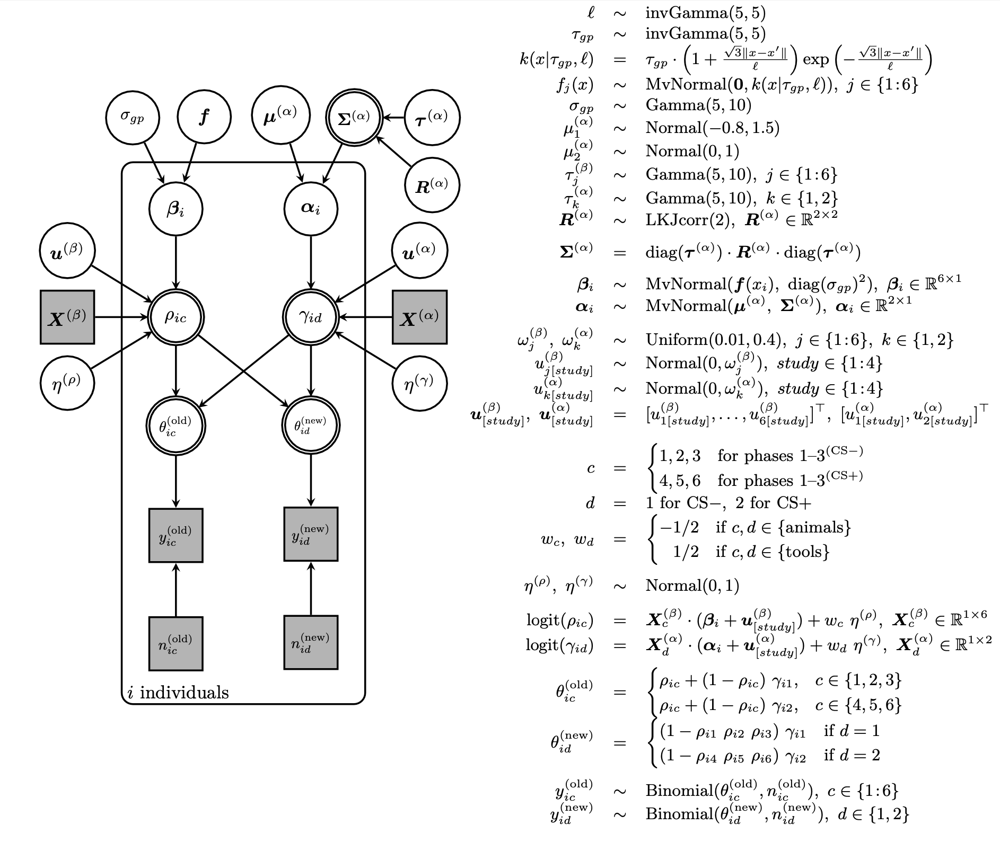
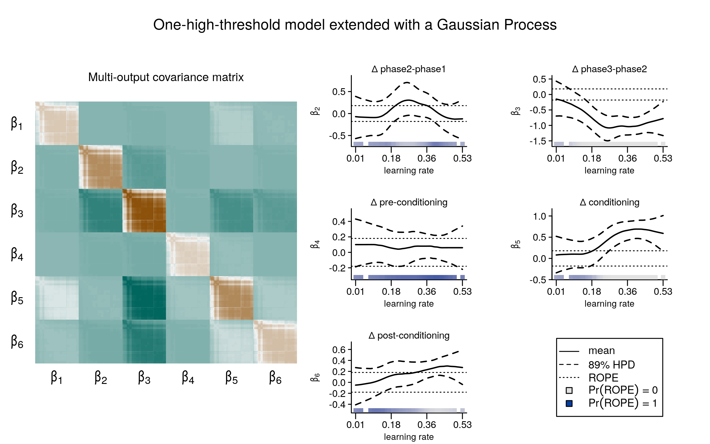

> **Big Thanks** to my collaborators at the Department of Cognitive Psychology @UHH and @HiB in Tuebingen.

---

<figure>
  
  <figcaption>Figure: Graphical model of the extended model with a Gaussian Process (GP) prior over the memory recognition parameters</figcaption>
</figure>

---

---

#### Abstract

Episodic memory organizes continuous experience into discrete events, often limiting integration across temporal gaps. Emotionally salient experiences, such as learning about threats, may nevertheless enhance memory for motivationally relevant information across nominal event boundaries. Yet evidence for such cross-boundary modulation is mixed, suggesting that emotional learning may not exert a uniform effect on episodic memory across individuals. Here, we examined whether this heterogeneity reflects a mixture of divergent tendencies in how individuals structure their experience in memory – by temporal boundaries or by emotional relevance. Young adults (N = 285) incidentally encoded neutral images from two categories (animals, tools) across three temporally separated phases: pre-conditioning, conditioning, and post-conditioning. During conditioning, one category was partially reinforced with mild electric shocks to establish a category-level threat association. Memory was tested 24 hours later using a surprise old-new recognition task. Although no reliable cross-phase enhancement was evident at the group level, data-driven individual-level analyses revealed two distinct patterns of episodic memory modulation. One pattern showed declining memory across phases, with emotional effects confined to shock-predictive items encoded during conditioning. The other showed memory structured around the emotional learning episode, with category-selective prioritization extending into the post-conditioning phase. These findings suggest that enhanced memory for subsequent threat-relevant information emerges specifically in individuals for whom the emotional learning episode, rather than nominal temporal structure, becomes the primary anchor of memory organization.

## License 

This work is licensed under [CC BY 4.0](https://creativecommons.org/licenses/by/4.0/?ref=chooser-v1).

---

#### Download 

[Preprint [PDF]](main.pdf)
[Preprint -- supplement [PDF]](sm.pdf)